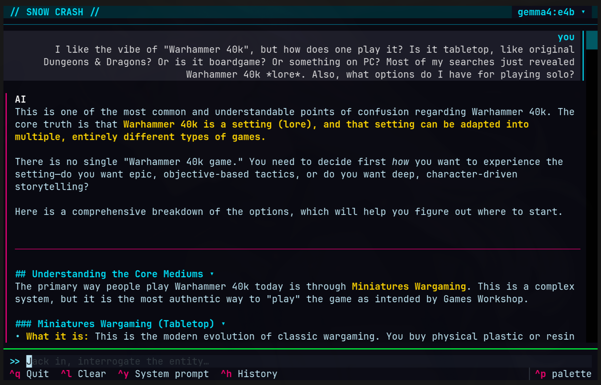

# Snow Crash

A cyberpunk-themed terminal chat client for [Ollama](https://ollama.com).



## Prerequisites

- [Ollama](https://ollama.com) installed and running locally
- [uv](https://docs.astral.sh/uv/) for Python package management
- Python 3.10+

## Quick Start

```bash
# Clone and enter the repo
git clone <repo-url>
cd snow-crash

# Install dependencies and launch
uv sync
uv run snow-crash
```

## Controls

| Key | Action |
|-----|--------|
| `Enter` | Send message |
| `Ctrl+Y` | Toggle system prompt bar |
| `Ctrl+H` | Browse and restore past chat sessions |
| `Ctrl+L` | Clear current conversation |
| `Ctrl+Q` / `Ctrl+C` | Quit (auto-saves the session) |

## Features

- Streams responses token-by-token from any locally available Ollama model
- Persists chat history to `~/.local/share/snow-crash/chats/` (YAML front-matter Markdown)
- System prompt survives restarts
- LaTeX math expressions (`$...$`, `$$...$$`) converted to Unicode on the fly
- Markdown headings in responses become collapsible sections
- Cyberpunk color theme with animated `>>` prompt and rainbow heading effect while waiting for responses

### Soon

- [ ] search within chat
- [ ] strip emojis (and other elements of choice) from chat rendering
- [ ] better in-app editor of system prompts (esp. multi-line)

### Done

- [x] auto-multi-line input line, as needed
